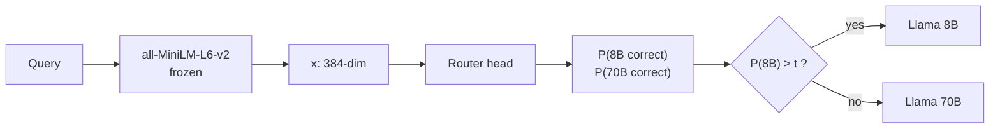
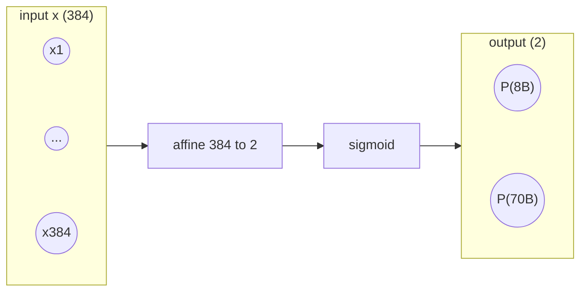
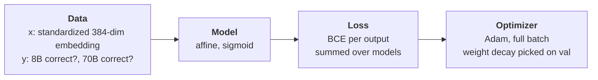
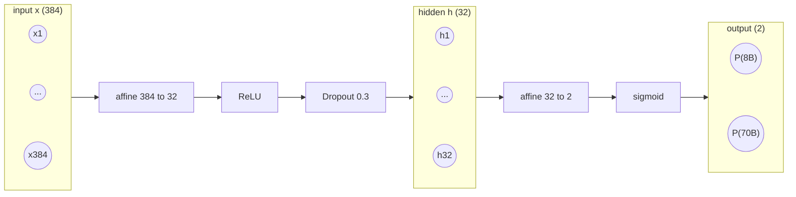
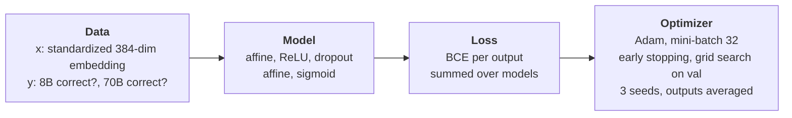

# Models / Workflow

```mermaid
flowchart LR
    Q[Query] --> E[all-MiniLM-L6-v2<br/>frozen] --> X[x: 384-dim] --> H[Router head] --> P["P(8B correct)<br/>P(70B correct)"] --> R{"P(8B) > t ?"}
    R -- yes --> C[Llama 8B]
    R -- no --> D[Llama 70B]
```

## Linear probe

```mermaid
flowchart LR
    subgraph IN["input x (384)"]
        direction TB
        x1((x1)) ~~~ xd((...)) ~~~ xn((x384))
    end
    subgraph OUT["output (2)"]
        direction TB
        o1(("P(8B)")) ~~~ o2(("P(70B)"))
    end
    IN --> A["affine 384 to 2"] --> S["sigmoid"] --> OUT
```

```mermaid
flowchart LR
    D[<b>Data</b><br/>x: standardized 384-dim embedding<br/>y: 8B correct?, 70B correct?] --> M[<b>Model</b><br/>affine, sigmoid] --> L[<b>Loss</b><br/>BCE per output<br/>summed over models] --> O[<b>Optimizer</b><br/>Adam, full batch<br/>weight decay picked on val]
```

## MLP probe

```mermaid
flowchart LR
    subgraph IN["input x (384)"]
        direction TB
        x1((x1)) ~~~ xd((...)) ~~~ xn((x384))
    end
    subgraph HID["hidden h (32)"]
        direction TB
        h1((h1)) ~~~ hd((...)) ~~~ hn((h32))
    end
    subgraph OUT["output (2)"]
        direction TB
        o1(("P(8B)")) ~~~ o2(("P(70B)"))
    end
    IN --> A1["affine 384 to 32"] --> R["ReLU"] --> DO["Dropout 0.3"] --> HID
    HID --> A2["affine 32 to 2"] --> S["sigmoid"] --> OUT
```

```mermaid
flowchart LR
    D[<b>Data</b><br/>x: standardized 384-dim embedding<br/>y: 8B correct?, 70B correct?] --> M[<b>Model</b><br/>affine, ReLU, dropout<br/>affine, sigmoid] --> L[<b>Loss</b><br/>BCE per output<br/>summed over models] --> O[<b>Optimizer</b><br/>Adam, mini-batch 32<br/>early stopping, grid search on val<br/>3 seeds, outputs averaged]
```

## Routing rule

Cheapest model with P(correct) > t, otherwise the most expensive. Sweep t from 0 to 1 for the accuracy-vs-cost curve.
